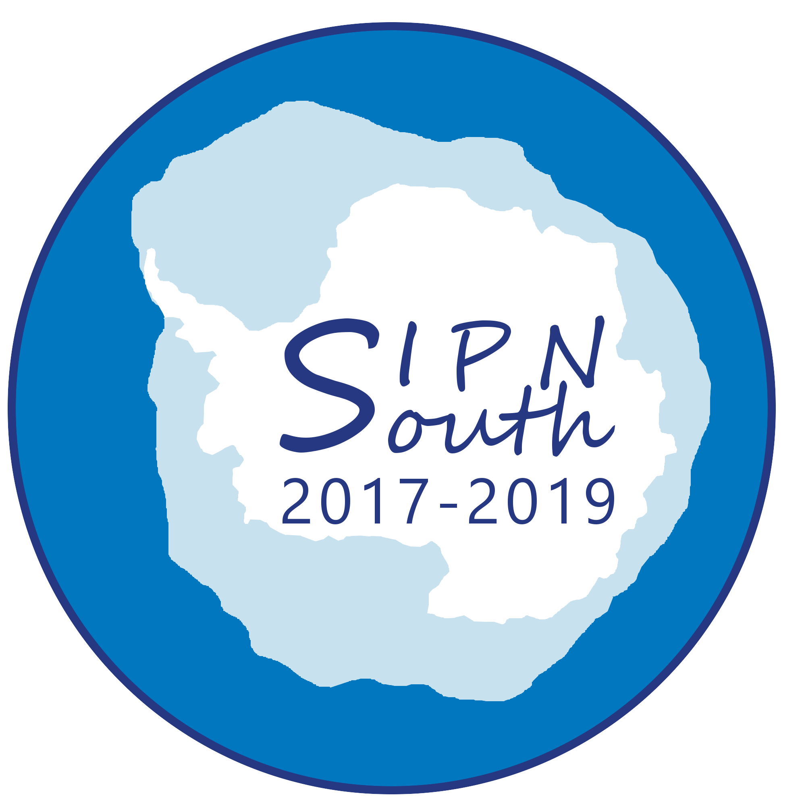

# SIPN South scripts and data
Welcome to the public SIPN South directory. Here, you will find the data and scripts necessary to process Sea Ice Prediction Network South (SIPN South) analyses.



# Quick start
Assuming that Git is installed:
1. In a terminal, do
```
git clone https://github.com/fmassonn/sipn-south-public.git
```
2. Go to the scripts directory to download the SIPN South forecast data:
```
cd sipn-south-public/scripts
./retrieve_data.bash   # Will fill the folder netcdf with data, takes a few minutes. 
                       # You can specify in that script the year(s) for which you want
                       # to retrieve data
```

3. Process the Python and NCL scripts

* Fig. 1 of the report --> `timeseries_Feb_Antarctic.py`
* Fig. 2 of the report --> Not yet available
* Figs 3. and 4. of the report --> `total-area_analysis.py`
* Fig. 5. of the report --> `SIPN_month_stat_bylon.ncl`
* Fig. 6. of the report --> `SIPN_SIA_daylon_contour.ncl`
* Fig. 7 and 8. of the report --> `spatial_sip.py` and then `assemble.bash`


# Structure of the project
```
data
  txt
    # contains data of total and regional sea ice areas
  netcdf
    # empty at initialization, but can be populated by running the script 
    # ../scripts/retrieve_data.bash . The data will be downloaded from
    # the following link: https://nextcloud.cism.ucl.ac.be/s/gTL53xhjp4iQMM8 

scripts
  # contains scripts to retrieve observational data, forecast data, format them in 
  # CMIP-like format. Also contains scripts to produce figures.

figs
  # empty folder aimed at receiving the figures produced by the scripts

doc
  # contains the form with answer of participating groups to the SIPN South forecast
```
# Reference
F. Massonnet, P. Reid, J. L. Lieser, C. M. Bitz, J. Fyfe, W. Hobbs (2018). Assessment of February 2018 sea-ice forecasts for the Southern Ocean. Technical
Note, Université catholique de Louvain (2018), available at http://acecrc.org.au/sipn-south/

# Primary Contact
francois.massonnet@uclouvain.be
